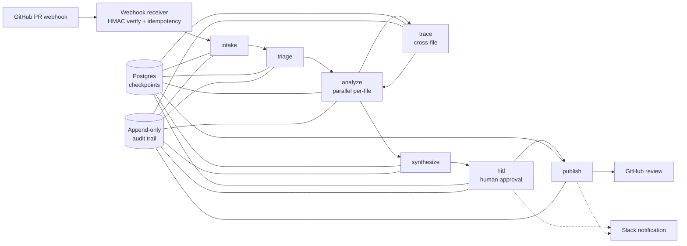

# Outrider

**▶ Live demo — [outrider-review.duckdns.org](https://outrider-review.duckdns.org/#token=demo_0d4890832aa14a0c0b3d64cb38bae952)** · a keyless, read-only dashboard over six seeded reviews (token pre-filled, no signup). Open a review's findings, browse the append-only audit trail, and run a replay.

Outrider is a self-hosted AI code-review agent for GitHub. A seven-stage LangGraph pipeline
reviews eligible pull requests and can post an ordinary GitHub review with inline comments
and suggested fixes. For supported languages (Python and JS/TS/TSX today), tree-sitter gives the
review structural context rather than a bare diff: on the normal clean-parse path, the model
sees the complete bodies of the code scopes containing added lines, with the diff hunks
clipped to those same boundaries.

It is built around a specific trust posture: **models propose, deterministic code disposes.**
Model stages choose file tiers, classify overall risk, and propose findings, summaries, and
fix suggestions. Deterministic code owns the trust-critical publication gates: severity comes
from a
versioned policy table (the model has no severity field to set), evidence claims are
schema-enforced, comment placement comes from coordinate translation, and no critical or high
severity finding reaches GitHub without explicit human approval from the dashboard. Every step
along the way (each completed LLM exchange, file examination, cross-file trace, finding, human
decision, and publish routing) lands in an append-only audit trail, and a background job
verifies replay equivalence for each completed production review after a short settle window.

You run it on your own infrastructure, with **your own LLM API keys** (Anthropic by default,
with OpenAI-compatible hosts such as Fireworks and Baseten (GLM-5.2 tested) supported). Beyond GitHub itself, raw source context, diff
patches, and the PR title go only to your configured model provider (Slack, when enabled, gets
limited notification fields, and model-written finding titles may quote short fragments). Everything Outrider stores stays in
your Postgres. Review, finding, and LLM-exchange content ages out under retention windows you
configure. Two stores sit outside those windows: the append-only audit metadata, and the
LangGraph checkpoint store, which Outrider does not purge or scrub in V1 whether it shares the
application database or runs separately. Apply your own retention controls to it.

[](https://github.com/ddamme05/Outrider/actions/workflows/ci.yml)

[](LICENSE)

> [!IMPORTANT]
> Outrider is under active development. The core GitHub review workflow is implemented, tested,
> and has driven real pull requests end-to-end on sandbox repositories. It has no production
> users yet, and configuration surfaces and APIs may still change before a stable release. Read
> [What Outrider is not](#what-outrider-is-not) before forming expectations.

## Table of contents

- [How a review works](#how-a-review-works)
  - [A file's journey](#a-files-journey)
- [Design guarantees](#design-guarantees)
- [Evaluation](#evaluation)
- [How Codex and GPT-5.6 helped me build Outrider](#how-codex-and-gpt-56-helped-me-build-outrider)
- [Quickstart](#quickstart)
- [Configuration](#configuration)
- [Security and privacy](#security-and-privacy)
- [What Outrider is not](#what-outrider-is-not)
- [Known limitations](#known-limitations)
- [Development](#development)
- [License](#license)

<!-- TODO(screenshots): 1) PR opened → 2) dashboard approval screen → 3) posted GitHub review.
     Use a sandbox repo. Redact installation ids and webhook URLs. -->

---

## How a review works



The seven logical stages. The analyze stage fans out to parallel per-file workers, so the
physical graph has a few more vertices than seven.

1. **intake** fetches the PR file list and per-file content from GitHub. No LLM call.
2. **triage** is a fast model pass that assigns each file a deep, standard, or skim tier and
   classifies overall PR risk. Deep and standard files enter the core analyze stage, and skim
   files do not. Oversized pull requests are skipped deterministically during intake, before
   triage runs.
3. **analyze** is the core review. For each admitted clean-parsed file, tree-sitter extracts
   the code scopes containing added lines and builds a focused context window. Deep-tier files go to the stronger
   model and standard-tier files to the cheaper one, all under a pre-flight token budget.
   That split is the Anthropic default, and a GLM host serves both tiers with one model. A
   deterministic catalog of 19 tree-sitter structural checks (Python and JS/TS, mostly
   security plus reliability patterns) contributes findings alongside the model's.
4. **trace** handles findings that may depend on code outside the diff. It ranks candidate
   imports, derives and validates possible repository paths, and resolves them through bounded
   GitHub fetch probes. A uniquely resolved file loops back to analyze only when it sits
   outside the diff, was not already fetched, fits the fetch budget, and fetches as usable
   text, all with bounded depth.
5. **synthesize** merges findings from all rounds into one deduplicated, severity-ordered
   report and generates bounded fix suggestions for eligible findings.
6. **hitl** is the human gate. If any finding is critical or high severity, the graph
   interrupts and persists its state. A human approves, rejects, overrides severity, or
   suppresses each finding from the dashboard. By default nothing critical or high reaches
   GitHub without that decision, ever. The timeout action is `expire_only`, not auto-post.
7. **publish** posts one GitHub review when at least one eligible or surfaced finding
   remains, and otherwise records `no_op_empty` and makes no GitHub call. Each finding routes
   to an inline comment, the review body, or dashboard-only, based on whether its span maps to
   a reviewable diff line. That is a deterministic coordinate computation, never a model
   choice.

Review state checkpoints to Postgres at every node, so a review interrupted for human approval
survives process restarts and resumes in a fresh process.

### A file's journey

What stays local and what reaches the model, stage by stage:

```mermaid
flowchart TD
    GH["GitHub pull request webhook"] --> IN["Intake"]

    IN --> FETCH["Validate paths and limits<br/>fetch patch and complete eligible content<br/>at the exact base and head SHAs"]
    FETCH --> CP[("Postgres checkpoint<br/>patch plus fetched file content")]

    FETCH -->|"PR title, file metadata, and patch"| TR["Triage model"]
    TR --> TIER{"File tier"}

    TIER -->|"skim"| SKIM["Excluded before analyze<br/>(recorded in checkpointed<br/>triage state)"]
    TIER -->|"deep or standard"| LANG{"Language supported?"}
    LANG -->|"no"| ASKIP["Audited analyze skip<br/>(per-file examination event)"]
    LANG -->|"yes"| TS["Tree-sitter parses<br/>the complete file locally"]

    TS --> OUT{"Parser and<br/>degradation outcome"}
    OUT -->|"clean scopes"| SELECT["Select scopes containing added lines<br/>run structural checks locally"]
    OUT -->|"parse errors in changed regions"| DEG["Degraded path<br/>(model proposals admit as judged)"]
    OUT -->|"vendored, oversized, or no changed scopes<br/>and no eligible module-level match"| ASKIP
    SELECT --> BUD{"Pre-flight budget<br/>admits the call?"}
    DEG --> BUD
    BUD -->|"scope bodies or bounded hunks,<br/>clipped hunks, fired query IDs"| AN["Analyze model"]
    BUD -->|"exhausted: audited skip<br/>(deterministic structural findings<br/>can still land)"| ASKIP

    AN --> ADMIT["Validate proposals<br/>apply deterministic severity<br/>and coordinate gates"]

    ADMIT --> ROUND{"Initial analyze pass?"}
    ROUND -->|"yes"| CAND{"Admitted finding has<br/>trace candidates?"}
    ROUND -->|"no: post-trace pass"| SYN
    CAND -->|"yes: candidate identifiers,<br/>import strings, and reasons"| RANKQ{"Within-finding ordering<br/>nontrivial?"}
    RANKQ -->|"yes"| RANK["Trace ranking model"]
    RANKQ -->|"no, deterministic order"| RESOLVE["Derive and validate candidate paths<br/>run bounded GitHub fetch probes"]
    RANK --> RESOLVE
    RESOLVE -->|"uniquely resolved"| P2{"Eligible? outside the diff,<br/>not already fetched,<br/>budget left"}
    P2 -->|"yes"| FET["Fetch attempt"]
    P2 -->|"no: no new file"| SYN
    FET -->|"usable content"| RELATED["Parse the resolved<br/>related file locally"]
    FET -->|"404 or unusable content:<br/>no new file"| SYN
    FET -->|"other fetch failure"| ERR["Review run fails<br/>(no partial trace)"]
    RESOLVE -->|"unresolved or ambiguous:<br/>no fetch, logged decision"| SYN
    RESOLVE -->|"other fetch failure"| ERR
    RELATED --> PTGATE{"Supported language,<br/>parse yields reviewable scopes?"}
    PTGATE -->|"no: audited skip,<br/>no model call"| SYN
    PTGATE -->|"yes"| PTBUD{"Post-trace prompt<br/>within budget?"}
    PTBUD -->|"no: audited skip,<br/>no model call"| SYN
    PTBUD -->|"yes: error-free scope bodies<br/>plus the originating finding"| POST["Post-trace analyze model"]
    POST --> ADMIT

    CAND -->|"no"| SYN["Synthesis and fix calls<br/>(finding text and metadata, risk, metrics;<br/>one target line per fix)"]
    SYN --> HITL["Human approval when required"]
    HITL --> PUB["Publish eligible findings to GitHub"]

    HITL -.-> SL["Slack notification<br/>limited fields only"]
    PUB -.-> SL
```



Intake fetches complete eligible file content (bounded per file and per review) because
tree-sitter parsing, the structural checks, coordinate validation, and suggested-fix anchoring
all need the authoritative source. For modified and renamed files, both the base and head
versions are retained in review state.

On the normal clean-parse path, the analyze call does not send the complete file to the
model. Outrider parses the complete file locally, identifies the scopes containing added
lines, and sends the complete bodies of those scopes together with diff hunks clipped to the
same boundaries. A supported file whose changed regions fail to parse takes a degraded path
instead: bounded diff hunks without scope bodies, with its findings admitted as model
judgment only. The model gets
the surrounding logic inside the changed function or class without unrelated code from
elsewhere in the file. Focused context narrows the model's review surface and lets admission
bind findings to known scope ranges. It is intended to lower input tokens, but overlapping
nested scopes can duplicate source (the budget planner reserves for exactly that), so cost
and quality against whole-file context remain measurements to run, not guarantees.

When a finding may depend on another file, trace ranks the proposed dependency, derives and
validates possible repository paths, and uses bounded GitHub fetch probes to resolve it. A
uniquely resolved file is fetched and parsed locally only when it sits outside the diff, was
not already fetched, and fits the fetch budget. A follow-up analyze pass then examines its
error-free scope bodies. A missing file just logs the decision, while a transport failure
aborts the trace pass rather than silently continuing.

## Design guarantees

The load-bearing properties, with links to the public architecture-decision records in
[DECISIONS.md](DECISIONS.md) where a numbered decision established them:

| Guarantee | Mechanism |
|---|---|
| Severity is never model-assigned | The LLM picks a `FindingType` from a 22-member enum. A frozen, versioned policy table maps type to severity. The response schema has no severity field (`extra="forbid"`), the policy table is immutable at runtime, and historical reviews replay under the policy version they ran under. |
| Findings can't claim evidence they don't have | Every finding carries an evidence tier: `observed` (a tree-sitter query fired, with the query id), `inferred` (a recorded trace path), or `judged` (model judgment). The check is layered: the schema requires an id, analyze admission verifies the id belongs to a query that actually fired, and replay later verifies registry membership. |
| High-risk findings require a human | Critical and high findings gate at an interrupt checkpoint. The review resumes only on an explicit per-finding decision (dashboard `POST /reviews/{id}/decide`), and a timed-out approval expires without posting. |
| Reviews are reconstructable | Append-only `audit_events` (database triggers block UPDATE and DELETE, verified by an integration test), with asynchronous replay-equivalence verification of each eligible completed production review by a background job (eval runs excluded). Replay validates event structure, proof references, and content hashes. Re-executing stored queries against evidence spans is future scope. |
| Vendor SDKs are quarantined | `anthropic` and `openai` import only under `llm/`, `githubkit` under `github/` and the webhook receiver, `tree_sitter` under `ast_facts/` and the query catalog (`queries/`), `slack_sdk` under `notify/`. A CI boundary lint enforces this ([#038](DECISIONS.md#038-the-cipre-commit-import-lint-is-the-deterministic-trust-boundary-floor-fup-005), [`scripts/check_import_boundaries.py`](scripts/check_import_boundaries.py)). Auditing or replacing a vendor dependency touches a small, explicitly bounded surface. |

## Evaluation

The quality tables below come from artifacts tracked in this repository. You can recompute
every number from the JSON without trusting this README.

### Cross-provider baseline (tracked artifact)

[`tests/eval/baselines/analyze-exemplars/analyze-v10+suite-v2.json`](tests/eval/baselines/analyze-exemplars/analyze-v10+suite-v2.json)
records 288 provider calls: three model configurations (two Anthropic tiers plus GLM on
Fireworks) × 32 fixtures (22 planted-vulnerability plus 10 safe) × 3 repetitions, majority
vote at 2 of 3. It was frozen 2026-07-15 as the pre-registered bar that
future prompt changes must clear. The gate binds the analyze prompt version plus a content
digest of the shared system prefix. The user-side message templates are not yet covered by
that digest, and widening the bound identity is tracked follow-up work.

| Model configuration (as recorded) | Vulnerable fixtures detected | Safe fixtures wrongly flagged | Structured outputs accepted |
|---|---:|---:|---:|
| `claude-sonnet-5` (deep tier) | 22 / 22 | 3 / 10 | 96 / 96 |
| `claude-haiku-4-5` (standard tier) | 21 / 22 | 6 / 10 | 96 / 96 |
| `accounts/fireworks/models/glm-5p2` | 18 / 22 | 0 / 10 | 96 / 96 |

Provenance: prompt `analyze-v10` (content digest `4520a0062443…`), fixture suite `suite-v2`,
measurement contract `exemplar-mc-2`, artifact schema v4. Frozen in commit `0d75028`. A later
commit (`e467626`) corrected one line of schema-version metadata, with every measured value
byte-identical. The eval gate accepts a prompt change only if, per provider and per finding
type, recall does not decrease, false positives do not increase, and per-fixture over-emission
does not grow. It fails closed unless both the prompt version and its content digest actually
changed.

> These results describe a versioned benchmark on controlled fixtures. They are not production
> performance, and not a statistical ranking of models. Three repetitions detect directional
> differences but cannot order model populations.

### Prompt-cache measurement (same artifact)

Input-side token classes for the 96 Sonnet calls in the baseline above:

```text
cache-read      1,033,030
cache-write        10,874
ordinary input     41,358
total           1,085,262   →  95.2% served from cache (Haiku: 94.8%)
```

This is a benchmark cache-read share under a sequential harness, not a measured production hit
rate or cost figure. The GLM/Fireworks share was 66.7% under the same harness. Its caching
showed no cross-request affinity in our probes, which is consistent with replica-local caching,
so parallel production traffic likely realizes less.

### Structured-output reliability (tracked artifact)

[`tests/eval/baselines/glm-yield/analyze-v10-glm-yield.json`](tests/eval/baselines/glm-yield/analyze-v10-glm-yield.json)
is a dedicated two-host read: 60/60 outputs accepted on Fireworks and 60/60 on Baseten, zero
rejected, zero provider errors, raw counts persisted. Combined with the baseline's 288/288, no
structured output was rejected in 408 recorded calls across three hosts.

### False-positive calibration (internally measured)

Early prompt versions behaved as if every review had to produce a finding. Fixing one wrong
label just moved the over-flag to a different finding type on the same clean code. Replacing
per-type carve-outs with a single calibration rule (an empty findings list is a valid, common,
correct result) cut false positives 28 → 5 across finding types with zero recall loss. The
probe: 3 prompt variants × 2 Claude models × 11 fixtures × 5 repetitions, 330 runs in all.

A note on provenance: the rule text ships in the production prompt and its exact wording is
pinned by a unit test ([`tests/unit/test_prompts_analyze.py`](tests/unit/test_prompts_analyze.py)),
but the raw probe artifact is not yet published in this repository. Treat 28 → 5 as an
internally measured result, unlike the tables above, which are recomputable from tracked JSON.

### The offline tiers

The eval harness's structural tier (currently 186 tests, collected by
`uv run pytest tests/eval/scenarios/structural --is-eval`) validates tree-sitter extraction and
coordinate translation with zero LLM calls and no network. Every fixture in the paid suite
is first driven through the real analyze admission path offline, so a fixture the pipeline
would skip or veto never reaches a paid run.

## How Codex and GPT-5.6 helped me build Outrider

I used [Codex](https://openai.com/codex/) with [GPT-5.6 Sol](https://openai.com/index/gpt-5-6/) as an independent reviewer throughout development.

Outrider has a catalog of rules covering things like severity, evidence, audit history, comment placement, and human approval. After each implementation pass, Codex read the diff and checked it against those rules, the project's trust boundaries, and its architectural decisions.

That review process caught several real problems. It found a Slack update race that could replace a finished status with stale text, a React StrictMode issue in the GitHub setup flow, and places where benchmark wording claimed more than the saved results could prove. It also caught smaller problems such as outdated comments and tests whose names promised more coverage than they actually provided.

Codex stayed read-only during these reviews. It reported findings with file and line references, explained which project rule was involved, and gave each finding a confidence level. I reviewed the findings, chose which ones to accept, and routed the accepted changes back through the implementation workflow. I ran the test suites and supplied the results for the next review.

Every review was recorded in a local append-only audit log, including clean reviews where Codex found nothing. That gave me a running history of what was checked, what was caught, and how each finding was handled.

Using GPT-5.6 Sol this way was especially helpful for changes that crossed several parts of the project. It could follow a workflow from the dashboard through saved state, background jobs, Slack, and GitHub, then point out where those pieces could disagree.

The process ended up looking a lot like Outrider itself: findings came with evidence, important decisions stayed with me, and each review left a record I could revisit later.

## Quickstart

**Prerequisites:** Docker with Docker Compose, a GitHub account that can create a GitHub App,
an Anthropic API key (or a Fireworks or Baseten key, see `OUTRIDER_LLM_HOST`), and an
HTTPS-reachable public URL for webhooks. A tunnel like ngrok works for evaluation.

```bash
git clone https://github.com/ddamme05/Outrider.git && cd Outrider
cp .env.example deploy/.env
# Edit deploy/.env. The file is fully commented. Minimum for a first boot:
#   POSTGRES_USER / POSTGRES_PASSWORD / POSTGRES_DB
#   ANTHROPIC_API_KEY
#   OUTRIDER_ADMIN_API_KEY            (dashboard bearer token, generate a random secret)
#   OUTRIDER_TRUNCATION_HMAC_SECRET   (generate a random secret, 32+ chars)
#   + GitHub App credentials: pick mode A or B below
docker compose --env-file deploy/.env -f deploy/docker-compose.prod.yml up -d --build
```

To use a GLM host instead of Anthropic, set `OUTRIDER_LLM_HOST=fireworks` plus
`FIREWORKS_API_KEY` (or `baseten` plus `BASETEN_API_KEY`) in place of the Anthropic key.

That is the whole sequence. The image builds the dashboard and installs dependencies, a
one-shot `migrate` container applies database migrations before the app starts, and the app
serves both the API and the dashboard on `127.0.0.1:8000`. That port is loopback only, so put
your own ingress in front, or add `--profile tls` plus `OUTRIDER_DOMAIN=review.example.com` in
`deploy/.env` to run the bundled Caddy with automatic HTTPS on ports 80 and 443. If you use
your own reverse proxy, disable or redact query-string logging for `GET /setup/callback` and
`GET /slack/oauth/callback` (both callbacks carry single-use secrets in their query strings,
which is also why the production image runs uvicorn with `--no-access-log`).

`GET /health` returns `{"status":"ok"}` once the app has booted. It is a liveness probe only
and does not check database or provider reachability.

> The root `docker-compose.yml` is development database infrastructure only (it has no app
> service). The production stack lives in `deploy/docker-compose.prod.yml`, and the
> `--env-file deploy/.env` flag is required. Without it Compose fails with a misleading
> "set POSTGRES_USER" error.

### GitHub App, mode A: click-through setup (recommended)

Outrider creates its own GitHub App for you from an [App Manifest](DECISIONS.md#070-self-service-onboarding-credential-mode--provider--setup-state-machine-refines-066).
Every deployment gets its own App, key, and webhook secret. There is no shared app and no
phone-home ([#066](DECISIONS.md#066-oss-self-host-via-github-app-manifest--one-app-per-deployment)).

Set in `deploy/.env`:

```bash
OUTRIDER_GITHUB_CREDENTIAL_SOURCE=database
OUTRIDER_PUBLIC_BASE_URL=https://review.example.com   # bare origin, HTTPS, no path
OUTRIDER_SETUP_STATE_SECRET=<generate-a-random-secret>       # 32+ chars
OUTRIDER_GITHUB_CREDENTIAL_ENC_KEY=<generate-a-key>          # python -c "import base64, os; print(base64.urlsafe_b64encode(os.urandom(32)).decode())"
```

Then open the dashboard's `/setup` page, enter your GitHub org, and follow the redirect. GitHub
creates the App (permissions `contents: read` and `pull_requests: write`, subscribed to
`pull_request` events, webhook pointed at `{base_url}/webhooks/github`) and redirects back.
Outrider verifies the response against what it requested, encrypts the private key and webhook
secret into Postgres, and sends you to GitHub's install page to pick repositories. Setup state
is a signed single-use token, so refreshing the callback URL fails by design.

Until setup completes, the webhook receiver and other credential-dependent routes return 503,
while `/setup`, `/health`, `/privacy`, and the read-only dashboard stay up. GitHub does not
retry failed webhook deliveries on its own, so if a PR event arrived during that window,
redeliver it from the App's settings page (Advanced → Recent Deliveries) once setup finishes.

Generate every secret above independently. Startup rejects a setup-state secret that matches
any other configured secret root, and rejects reusing the GitHub credential-encryption key as
the Slack token-encryption key. It does not check every other pair for reuse, so keeping the
rest distinct is on you.

### GitHub App, mode B: bring your own App (default)

Create a GitHub App manually (same permissions and events as above, webhook URL
`{your-base-url}/webhooks/github`, a webhook secret you generate) and set:

```bash
OUTRIDER_GITHUB_APP_ID=<app id>
OUTRIDER_GITHUB_APP_PRIVATE_KEY=<PEM contents>
OUTRIDER_GITHUB_WEBHOOK_SECRET=<your webhook secret>
```

The `OUTRIDER_` prefix is required. A bare `GITHUB_APP_ID` is silently ignored, and so is a
misspelled name inside the prefix, so double-check the three names. A missing required variable
fails at startup with the field named.

### Slack notifications (optional)

Slack integration is **outbound notifications only**. Each review normally produces one of
two message kinds. A review that pauses for approval gets a card carrying the repository, PR
number and title, severity counts, and up to three gated findings with their severity, type,
file location, and model-written title (an overflow line summarizes the rest). A review that
publishes without gating gets a one-line message carrying the repository, PR number, and
posted versus dashboard-only counts. Descriptions, evidence,
suggested fixes, and source context are not sent to Slack, though model-written
titles may quote short source fragments. Both kinds deep-link to the
dashboard when
`OUTRIDER_DASHBOARD_BASE_URL` is set and omit the link otherwise. You cannot trigger reviews
or approve findings from Slack. Delivery and deduplication are best effort. Outrider posts
to Slack before it records the post, so a failure to record can repeat a message after a
resume, and a persistently failing record can let one gated review receive both message
kinds. Configure a Slack app with the `chat:write` scope, set
`OUTRIDER_SLACK_CLIENT_ID`, `OUTRIDER_SLACK_CLIENT_SECRET`, `OUTRIDER_SLACK_REDIRECT_URI`,
`OUTRIDER_SLACK_STATE_SECRET`, and `OUTRIDER_TOKEN_ENC_KEY`, then connect a channel.

The simplest way is the dashboard: open **Connect Slack** in the sidebar, enter the GitHub
installation id and the Slack channel id, and click Connect. That sends you to Slack to
approve the app, Slack redirects back, and the bot token is stored encrypted. This runs only
when the app is serving the built dashboard (the same one-origin requirement as GitHub App
setup), not on the Vite dev server.

For a headless deployment you can drive the same endpoint by hand. It needs your admin bearer
token (export it from `deploy/.env` first, since the quickstart only wrote it there), then
fetch the redirect with curl and open the returned Slack URL in a browser:

```bash
export OUTRIDER_ADMIN_API_KEY="$(grep -E '^OUTRIDER_ADMIN_API_KEY=' deploy/.env | cut -d= -f2-)"
curl -si -H "Authorization: Bearer $OUTRIDER_ADMIN_API_KEY" \
  "https://review.example.com/slack/install?installation_id=<github install id>&channel_id=<C0000000000>" \
  | grep -i '^location:'
```

The GitHub installation id is the number at the end of the App's installation settings URL on
GitHub. The Slack channel id starts with `C` (or `G` for private groups) and sits at the
bottom of the channel's details
pane. The redirect URL carries an HMAC-signed, expiring `state` value binding the
installation and channel ids, and the public callback at `GET /slack/oauth/callback` verifies
that state before exchanging the code for a bot token (identity comes from the verified
state, never from the callback's own query parameters). After the OAuth install completes,
invite the bot to the channel (`/invite @Outrider`) so posts succeed. Bot tokens are
encrypted at rest. When the Slack variables are unset, Slack is simply off and never blocks
the review pipeline.

### Verify the installation

1. Open a pull request in a sandbox repository the App is installed on. The repo ships
   deliberately vulnerable demo fixtures under
   [`scripts/demo_fixtures/`](scripts/demo_fixtures/) (intentional, don't report them), with
   their own README covering the PR procedure, and expected outcomes in
   [`LIVE_RUN_EXPECTED_FINDINGS.md`](LIVE_RUN_EXPECTED_FINDINGS.md).
2. Watch the review appear in the dashboard: webhook received, stages progressing, then status
   `completed`, or `awaiting_approval` if anything critical or high was found.
3. If gated, approve or reject per finding in the dashboard. The review resumes, and it
   posts if at least one eligible or surfaced finding remains (medium and lower severities
   are eligible without approval). If nothing eligible or surfaced remains, publish records
   `no_op_empty` and makes no GitHub call.
4. When a GitHub review is posted, it appears under your App's bot account, with findings
   placed inline on the diff where coordinates allow.

Don't plant a real vulnerability in a repository that matters to test this.

## Configuration

[`.env.example`](.env.example) is the complete, commented reference for every variable. The
load-bearing subset:

| Variable | Required | Default | Purpose |
|---|---|---|---|
| `DATABASE_URL` | yes (the prod compose derives it) | none | Postgres, `postgresql+psycopg://` scheme enforced |
| `CHECKPOINT_DATABASE_URL` | no | falls back to `DATABASE_URL` | separate LangGraph checkpoint store. Content-bearing and not purged by Outrider in V1 (shared or split), so your retention controls must cover it |
| `OUTRIDER_ADMIN_API_KEY` | yes | none | dashboard and approval-endpoint bearer token |
| `OUTRIDER_TRUNCATION_HMAC_SECRET` | yes | none | authenticates truncation markers in sanitized output |
| `ANTHROPIC_API_KEY` | with the default host | none | LLM provider key |
| `OUTRIDER_LLM_HOST` | no | `anthropic` | `anthropic`, `fireworks`, or `baseten` ([#056](DECISIONS.md#056-openai-compatible-providers-via-a-host-qualified-hostprofile-registry)) |
| `OUTRIDER_MODEL_ANALYZE_MODEL` | no | `claude-sonnet-5` | deep-tier analyze model |
| `OUTRIDER_MODEL_STANDARD_ANALYZE_MODEL` | no | `claude-haiku-4-5` | standard-tier analyze model |
| `OUTRIDER_ANALYZE_REVIEW_BUDGET_TOKENS` | no | `200000` | pre-flight per-review token budget |
| `OUTRIDER_MAX_CONCURRENT_REVIEWS` | no | `8` | per-process concurrent-review cap |
| `OUTRIDER_HITL_TIMEOUT_ACTION` | no | `expire_only` | what happens when approval times out. The default never auto-posts |
| `OUTRIDER_AUDIT_LLM_CONTENT_RETENTION_TTL` | no | `P90D` | LLM-content retention, ISO-8601 duration. Two sibling TTLs cover findings and reviews |
| `OUTRIDER_PATCHES_ENABLED` | no | `true` | suggested-fix patches, bounded by `OUTRIDER_MAX_PATCH_SUGGESTIONS_PER_REVIEW` (default 5) |
| `OUTRIDER_ENABLE_DOCS` | no | off | opt-in `/docs` and `/openapi.json`, off in production by default |

Sharp edges worth knowing: `.env` values don't interpolate, so if you change
`POSTGRES_PASSWORD` you must also update the password inside `DATABASE_URL` (the prod compose
stack handles this for you). Retention TTLs parse as ISO-8601 durations (`P90D`, `PT24H`), not
integer seconds. A few variables documented near the end of `.env.example` are marked as not
yet read by any code.

## Security and privacy

**What leaves your infrastructure.** The project's user-facing privacy statement is pinned
under change control by
[#015](DECISIONS.md#015-zdr-is-an-operator-attestation-not-a-runtime-opt-in) and
[#016](DECISIONS.md#016-llm-exchanges-stored-locally-under-retention-logs-stay-metadata-only)
(rewording it requires a superseding decision, not a README edit):

> Outrider sends data to the configured LLM provider only through its review-stage model calls. Depending on the stage, this includes: the PR title, changed-file paths and metadata, diff patches, complete bodies of scopes containing added lines (or bounded diff hunks on degraded paths), structural query identifiers, trace candidate identifiers, import strings, and reasons, scope bodies from uniquely resolved related files, finding identifiers, metadata, titles, descriptions, and evidence, target source lines used for suggested fixes, and the risk classification and metrics used to generate the final summary. Outrider does not currently send the PR body, author login, commit messages, or branch names; adding any of these requires a new privacy-contract amendment. Complete eligible file content is fetched and checkpointed locally. Outrider does not send the separately fetched base and head file blobs as whole-file payloads during normal analysis, but GitHub diff patches may contain most or all of an added or heavily rewritten file. Under Anthropic's default terms, API inputs and outputs are deleted within 30 days, though retention can extend under contractual arrangements, Usage Policy enforcement, or legal requirements; content flagged for policy violations is retained up to 2 years, classification scores up to 7 years; no data is used for training without permission. If your organization has a ZDR arrangement with Anthropic, set `ANTHROPIC_ZDR_ENABLED=true` — Outrider uses the flag to adjust its startup notice and privacy statement; it does not enable ZDR on its own. Contact Anthropic sales if you need to arrange ZDR. Outrider does not currently support HIPAA-subject workloads.
>
> Outrider stores LLM request and response content in your local database under configured retention TTL (default values in operator configuration; purged on `installation.deleted` along with reviews and findings, per [#012](DECISIONS.md#012-data-retention-ttls-configurable-purge-on-installationdeleted) + [#014](DECISIONS.md#014-audit-events-are-metadata-only-content-purge-targets-reviews-and-findings)). Outrider does not transmit stored LLM content to any third party other than the configured LLM provider at request time per #013/#015's egress rules.

The pinned statement covers the default Anthropic host. Outrider's egress include list is the
same on every host. What changes with `OUTRIDER_LLM_HOST` is who receives the data and whose
terms govern its handling after receipt: see
[Fireworks](https://docs.fireworks.ai/guides/security_compliance/data_handling) and
[Baseten](https://docs.baseten.co/observability/security).

Application logs stay metadata-only. LLM content lives in the database, never in log streams.
Slack, when enabled, receives finding titles, types, severities, file locations, and
dashboard links. Descriptions, evidence, suggested fixes, and source context never go to
Slack (titles are model-written, so treat them as potentially quoting short fragments).

**Input hardening.** Webhook signatures verify with `hmac.compare_digest`. Payloads parse
through shape-validated schemas before anything downstream sees them (unknown GitHub fields
are deliberately tolerated for forward compatibility). File paths validate before
filesystem or API use. There is no shell execution with GitHub-sourced strings anywhere in the
application source tree (`src/outrider/`, CI-enforced). The deliberately vulnerable demo
fixtures under `scripts/demo_fixtures/` are the documented exception in the wider repo.
Database-stored GitHub App credentials (setup mode A) and Slack tokens are encrypted before
they are written to Postgres, and the App-setup callback carries single-use signed state. In
mode B the App credentials live in your environment, and protecting that file is on you.
Outrider does not include its own operator credentials (GitHub App private key, webhook
secret, installation tokens, Slack tokens) in model prompts. It
does not secret-scan repository content before review, so secrets accidentally
committed inside reviewed code can appear in patches and scope text like any other code.

**Reporting.** See [SECURITY.md](SECURITY.md). Please report suspected vulnerabilities
privately, not in a public issue. Outrider has **not** been independently audited or
penetration tested.

## What Outrider is not

- Not a replacement for human code review, and no guarantee every defect is found.
- Not a hosted service. You run it, on your infrastructure, with your provider keys
  ([#011](DECISIONS.md#011-self-hosted-is-canonical-v1-saas-is-v15)).
- No production deployments or users yet. Live validation has been on author-controlled
  sandbox repositories with planted vulnerabilities.
- The benchmark results above are controlled-fixture measurements, not production precision or
  recall.
- Slack is notification plus deep-link only. No review triggering, no inline approval.
- Reviews post as PR reviews. There is no GitHub Checks integration.
- Not independently security audited. No SLA. Not suitable for HIPAA-subject workloads.
- It does not train models on your code. Raw source context, diff patches, and the PR title
  go only to your configured model provider. Review output posts back to GitHub, and Slack (when
  enabled) receives only the limited notification fields described above (model-written titles
  may quote short fragments).

## Known limitations

- **Latency is unmeasured.** Instrumentation exists, but there is no published figure yet.
- **Cost per review at full coverage is unmeasured.** Internal sandbox runs (not a tracked
  artifact) came in around $0.10 to $0.12, but they ran under a token budget that skipped
  files. Treat any composed full-coverage figure as a model, not a measurement.
- **Module-level-only Python changes can escape LLM review.** A diff touching only imports or
  module constants is skipped unless a structural query matches, so a hardcoded secret added in
  a constants-only diff is not reviewed today. Known, tracked, and honestly the sharpest
  current gap. Our own eval fixtures found it.
- **Deletion-only changes can escape LLM review.** Scopes are selected by added lines. An
  otherwise reviewable file whose diff contains only deletions can receive no analyze call at
  all, and in a mixed file a deletion-only scope can be omitted even while another scope gets
  the file reviewed. Deleting an authorization check is the canonical bad case. Same family
  as the module-level gap.
- **Two cost optimizations run in shadow mode by default** (a trivial-scope filter and a
  file-hash analyze cache). They measure and audit but don't act, pending evidence. Savings
  claimed from them: none.
- **Prompts are tuned against Claude models only.** Prompt calibration was performed against
  Sonnet and Haiku. GLM runs the same prefix and holds its own baseline column above, but no
  GLM-specific calibration experiment has been run.
- **Structural analysis covers Python and JS/TS/TSX.** Files in other languages are skipped
  during analyze with an audited `UNSUPPORTED_LANGUAGE` event and do not receive model review
  today.
- **Replay verifies structure and hashes.** Re-executing tree-sitter queries against stored
  evidence spans is future scope.

## Development

```bash
uv sync --dev
.venv/bin/pre-commit install --install-hooks
cp .env.example .env                        # fill POSTGRES_* and TEST_POSTGRES_* for the DB containers
docker compose up -d postgres-test          # isolated tmpfs Postgres for the test tiers (port 5433)
export TEST_DATABASE_URL="$(grep -E '^TEST_DATABASE_URL=' .env | cut -d= -f2-)"
uv run pytest tests/unit                    # fast, no DB, needs no env
uv run pytest tests/integration             # real Postgres, mocked externals
uv run pytest tests/eval --is-eval          # eval harness (--is-eval is mandatory)
npm --prefix dashboard ci                   # install dashboard deps
npm --prefix dashboard run test             # dashboard (vitest)
```

The integration and eval tiers need only `TEST_DATABASE_URL` exported. The unit tier
deliberately runs with no environment at all.

CI runs eight jobs on every push to main and every pull request: lint, mypy (strict), the
trust-boundary import lint, unit, integration, eval, dashboard, and pre-commit checks. The
boundary lint ([`scripts/check_import_boundaries.py`](scripts/check_import_boundaries.py)) is
the deterministic floor under the vendor-SDK quarantine. CI fails on an `anthropic` import
outside `llm/`, a `tree_sitter` import outside `ast_facts/` and `queries/`, or shell
execution in the
application source tree.

Architectural decisions are recorded in [DECISIONS.md](DECISIONS.md): numbered, append-only,
and cited from code comments by anchor. If you want to know why something is the way it is,
start there.

```text
src/outrider/     agent/ (graph + nodes) · ast_facts/ (tree-sitter firewall) · coordinates/
                  llm/ · github/ · notify/ · policy/ · audit/ · api/ · prompts/ · sweep/
dashboard/        React 19 + Vite SPA (served by the app in production)
db/migrations/    Alembic (applied automatically by the prod compose stack)
tests/            unit / integration / eval tiers + tracked eval baselines
deploy/           production compose stack, Dockerfiles, demo stack
scripts/          boundary lint, invariant extraction, demo seeding, smoke tests
```

## License

[Apache-2.0](LICENSE).
